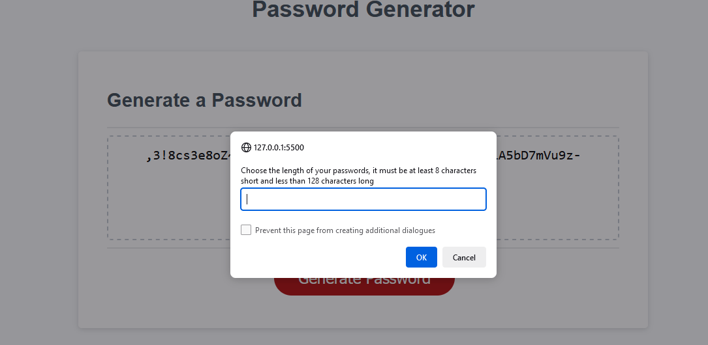
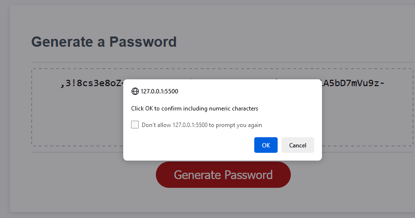
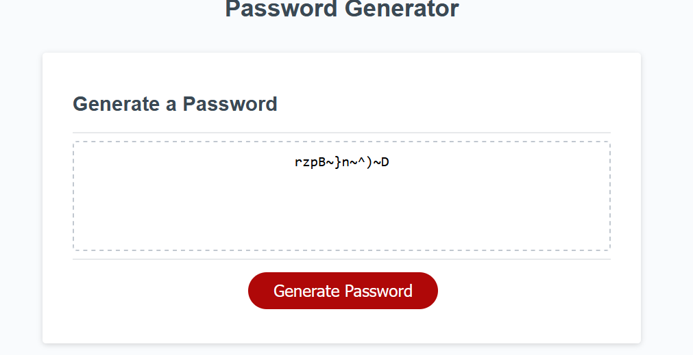

# Password Generator

This is a [simple password generator application](https://heisen101.github.io/Password-Generator/) that allows users to generate random passwords based on their preferences. The application uses JavaScript to dynamically create a password based on the selected criteria, including password length, inclusion of special characters, numeric characters, lowercase, and uppercase characters.
Here you could find the [code repository.](https://github.com/Heisen101/Password-Generator/blob/main/script.js) 

## How it Works

The password generator works as follows:

1. The user is presented with a prompt to choose the desired password length. The user must input a number that is at least 8 characters short and less than 128 characters long.

2. The user is then asked to confirm the inclusion of specific character types: special characters, numeric characters, lowercase characters, and uppercase characters.

3. Based on the user's input, the password generator will create a random password that satisfies the chosen criteria.

4. When the "Generate Password" button is clicked, the application will display the generated password in a textarea with the id "password."

## Arrays of Characters

The application uses four arrays to store different sets of characters:

- `specialCharacters`: Contains a list of special characters that can be included in the generated password.

- `numericCharacters`: Contains a list of numeric characters that can be included in the generated password.

- `lowerCasedCharacters`: Contains a list of lowercase alphabetical characters that can be included in the generated password.

- `upperCasedCharacters`: Contains a list of uppercase alphabetical characters that can be included in the generated password.

## Functions

1. `getPasswordOptions()`: This function prompts the user to choose the password length and character types for the password. It uses a do-while loop to validate the input and ensures that the user selects a valid password length.

2. `generatePassword(prom)`: This function generates a random password based on the user's preferences. It uses the selected character types to build the allowed characters string (`allowedC`) and then creates a password using a for loop with the desired length (`prom`).

3. `writePassword()`: This function calls the `generatePassword(prom)` function and writes the generated password to the textarea element with the id "password."

## How to Use

1. Open the "index.html" file in a web browser.

2. You will be prompted to choose the length of the password. Enter a valid number between 8 and 128.

   

3. Confirm whether you want to include special characters, numeric characters, lowercase characters, and uppercase characters in the password by clicking "OK" or "Cancel" for each prompt.

   

4. After clicking "OK" on the last prompt, click the "Generate Password" button to create password with different criteria. a password based on your preferences and displayed it in the textarea.

   

## Note

This password generator is for educational purposes and may not meet all security requirements for real-world use. Always use secure passwords and consider using a reliable password manager for sensitive accounts.

## License

This project is licensed under the [MIT License](LICENSE).

**Happy password generating!**
